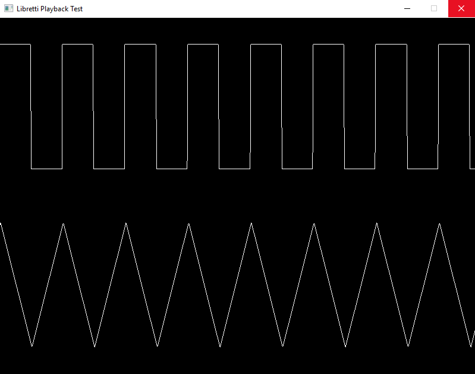

# [Libretti](https://github.com/Jean-LouisH/Libretti)

[Libretti](https://github.com/Jean-LouisH/Libretti) is **a synthesizer library for integration with applications and games**.

It can compile audio data from text files that are written with [Libretti's scripting language](https://github.com/Jean-LouisH/Libretti/blob/master/Documentation/Scripting%20Language%20Specification.txt)

It is named after the plural form of the Italian word "[Libretto](https://en.wikipedia.org/wiki/Libretto)" which means "booklet". A [Libretto](https://en.wikipedia.org/wiki/Libretto) is used for musical performances where musical notes, lyrics and performance cues are recorded. This is the same objective that Libretti is intended to address within digital applications: it is meant to define data structures that house the musical content, runtime information and means of communicating playback.

## Documentation

* [Libretti's Scripting Language](https://github.com/Jean-LouisH/Libretti/blob/master/Documentation/Scripting%20Language%20Specification.txt)
* [Script Validation Codes](https://github.com/Jean-LouisH/Libretti/blob/master/Documentation/Script%20Validation%20Codes.md)

## License

[MIT License](https://github.com/Jean-LouisH/Libretti/blob/master/LICENSE)

