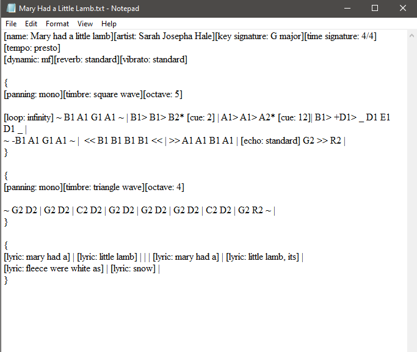

# [Libretti](https://github.com/Jean-LouisH/Libretti)

[Libretti](https://github.com/Jean-LouisH/Libretti) is **a synthesizer library for integration with applications and games**.

It can compile audio data from text files that are written with [Libretti's scripting language](https://github.com/Jean-LouisH/Libretti/blob/master/docs/Scripting%20Language%20Specification.txt)

It is named after the plural form of the Italian word "[Libretto](https://en.wikipedia.org/wiki/Libretto)" which means "booklet". A [Libretto](https://en.wikipedia.org/wiki/Libretto) is used for musical performances where musical notes, lyrics and performance cues are recorded. This is the same objective that Libretti is intended to address within digital applications: it is meant to define data structures that house the musical content, runtime information and means of communicating playback.

[Downloads](https://github.com/Jean-LouisH/Libretti/releases)

## Documentation

* [Libretti's Scripting Language](https://github.com/Jean-LouisH/Libretti/blob/master/docs/Scripting%20Language%20Specification.txt)

## Demos

https://github.com/Jean-LouisH/Libretti/assets/20573176/6cea7bbb-144f-4992-ade0-7d726cece182

Mary Had a Little Lamb

https://github.com/Jean-LouisH/Libretti/assets/20573176/f013661b-7b81-4545-999b-fcdc7e14853c

Starman Theme

https://github.com/Jean-LouisH/Libretti/assets/20573176/46cbbe97-48a2-4a11-a991-34dda989fc78

C Major Scale

https://github.com/Jean-LouisH/Libretti/assets/20573176/78c824da-c73b-40c1-826b-86bde99b5ed6

Accidentals Test

https://github.com/Jean-LouisH/Libretti/assets/20573176/e8cec713-c59f-4110-9f87-74fd773e940f

Crescendo Test

https://github.com/Jean-LouisH/Libretti/assets/20573176/2ff4498a-e779-422a-adc7-ed5239942274

Diminuendo Test

https://github.com/Jean-LouisH/Libretti/assets/20573176/955c33e4-68a5-441e-a718-523d9a6c1f21

Dynamic Accent Test

https://github.com/Jean-LouisH/Libretti/assets/20573176/7630de0c-3a18-4029-99d7-4899abf2f2d2

Dynamics Test

https://github.com/Jean-LouisH/Libretti/assets/20573176/85722e6f-d10e-4c90-955f-2d0cbac0d9ac

Multichannel Test

https://github.com/Jean-LouisH/Libretti/assets/20573176/08996c3d-2909-497b-bf52-3b28ad5b5cbe

Octave Test

https://github.com/Jean-LouisH/Libretti/assets/20573176/161d35f5-d8d8-411c-aad0-84ae2aba4020

Panning Test

https://github.com/Jean-LouisH/Libretti/assets/20573176/912bdcd9-ad46-4dac-b7b1-0a93e3932205

Slur Test

https://github.com/Jean-LouisH/Libretti/assets/20573176/d03cb567-1277-43c7-9a01-fed5c7134d13

Staccato Test

https://github.com/Jean-LouisH/Libretti/assets/20573176/8176c614-3cf2-4053-84d1-59e337d9dd44

Timbre Test

https://github.com/Jean-LouisH/Libretti/assets/20573176/694f881c-d698-47f8-a73c-c65fa0ff0fe4

Trill Test
